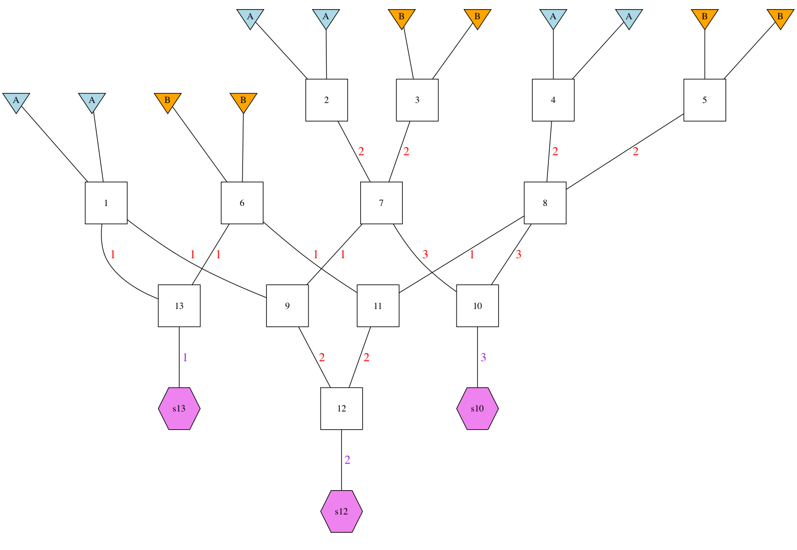
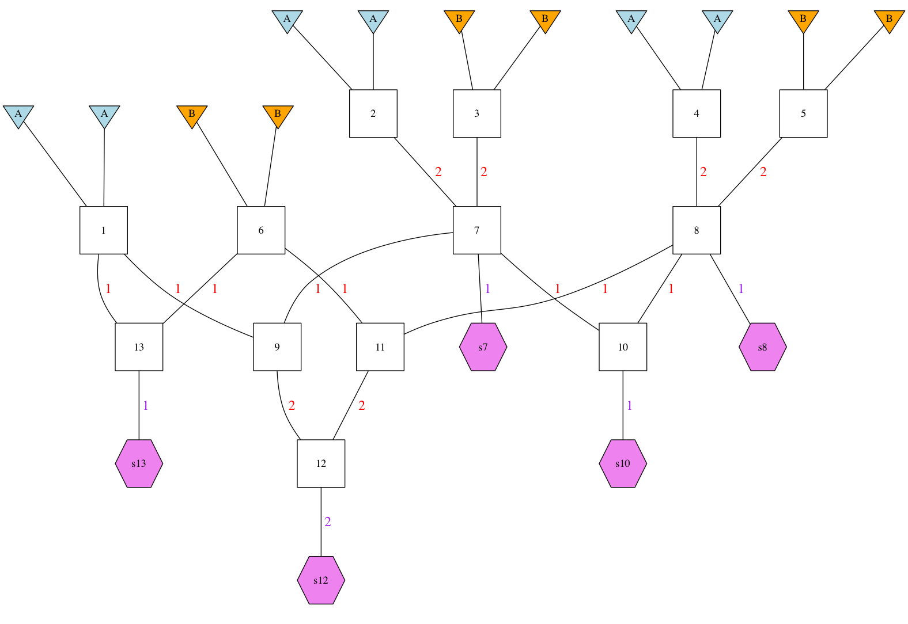

This is just some stuff while I am developing the package here.

# Map and Marker Stuff

## Get the map

Read the Torterau 1 Mb chunks map and turn it into something close to what we want.
Note that we make the end_pos of the one bin one less than the start_pos of the next 
bin (rather than identically the same. Looks like we do this by simply subtracting one 
from each.  (Ultimately, that probably doesn't make much difference.)

Note that the map is a flawed in two places where position is greater than position_1.  This
leads to negative probabilities and causes stuff to bomb.  So, I will just remove those
bogus intervals (they are on Chromosomes 2 and 10).
```{r}
library(tidyverse)
library(gscramble)

tort <- read_tsv("../inst/extdata/Torterau_et_al_2012_sus_scrofa_map.txt.gz",
                 skip = 5, 
                 locale = locale(decimal_mark = ",")) %>%
  filter(position < position_1) %>% 
  select(chrom = ssc,
         start_pos = position,
         end_pos = position_1,
         rec_rate = `rec rate`) %>%
  mutate(end_pos = end_pos - 1,
         chrom = as.character(chrom))
  
```

Now, we also want to get a first row on there that starts at 1 and ends
before the first start_pos on each chrom.  Sounds like a job for dplyr::do().
```{r}
tort2 <- tort %>%
  group_by(chrom) %>% 
  dplyr::do({
    x <- tibble(chrom = .$chrom[1],
                start_pos = 1,
                end_pos = .$start_pos[1] - 1,
                rec_rate = mean(.$rec_rate[1:5]))  # make recomb rate in this first interval the mean of the next 5
    bind_rows(x, .)
  }) %>%
  ungroup()
```

## Get the markers

Information we need here is in the ped and map files.

First the map file:
```{r}
marker_meta <- read_tsv("../inst/extdata/text_Missouri_329x25165.map.gz",
                        col_names = c("chrom", "variant_id", "pmap", "pos")) %>%
  mutate(chrom = as.character(chrom),
         idx = 1:n()) 

L <- nrow(marker_meta)  # get the number of markers
```

Then the ped file
```{r}
full_gmat <- scan("../inst/extdata/text_Missouri_329x25165.ped.gz", character()) %>%
  matrix(byrow = TRUE, ncol = 6 + 2 * L) 

# now we get the gmat_meta data: The first 6 rows.
gmeta <- as_tibble(full_gmat[, 1:6], .name_repair = "minimal") %>%
  setNames(c("pop", "indiv", "V3", "V4", "V5", "V6"))


gmat <- full_gmat[, -(1:6)] %>%
  t()
```
OK, that is now in a matrix that corresponds (somewhat) to the things in marker_meta.
It isn't exact because there are two columns for each marker, but we will be able to
deal with that.

In fact, let's do that now.  We will turn this into a matrix where every column is a "haplotype" (across
all the chromosomes), and each two columns are an individual.  
```{r}
gmatH <- rbind(
  gmat[c(T,F), ],
  gmat[c(F,T), ]
) %>%
  matrix(nrow = L)
```

And now we want to update gmeta to reflect these different haplotypes
```{r}
gmetaH <- tibble(
  pop = rep(gmeta$pop, each = 2),
  indiv = rep(gmeta$indiv, each = 2),
  haplo = rep(c(1, 2), length.out = nrow(gmeta) * 2),
  column = 1:(nrow(gmeta) * 2)
)
```
## Harmonize the markers and the map

We run into a little problem here in that the genotype data set has positions
in the genome that are beyond what is listed in the Torterau et al. map.

The thing to do, of course, would be to fix the mismatch here between the assembly that
the genotypes are positioned on and that used when Torterau made the map.  Tim 
and colleagues are, I think, working on that.  But for now I am just going to not worry 
too much about that---all I will do is add a final interval to the map when there
is a genotype that is beyond the current map.  This will have a recomb rate in cM/Mb that
is the mean of the previous 5 intervals.
```{r}
top_markers <- marker_meta %>%
  group_by(chrom) %>%
  summarise(hi = max(pos))

tort3 <- left_join(tort2, top_markers) %>%
  group_by(chrom) %>%
  dplyr::do({
    ret <- .
    if(max(.$end_pos) < .$hi[1]) {
      n <- nrow(.)
      x <- tibble(
        chrom = .$chrom[1],
        start_pos = .$end_pos[n] + 1,
        end_pos = .$hi[1] + 1,
        rec_rate = mean(.$rec_rate[(n-4):n])
      )  # make recomb rate in this first interval the mean of the next 5
      ret <- bind_rows(ret, x)
    }
    ret
  })
```
While we were at that, we left the hi position in there as essentially the length
of the chromosome.


Finally deal with map stuff.  First off, rec_rate is in cM/Mb
but the intervals are not exactly 1 Mb.  Note only that, we would like a 
recombination fraction across the interval, so we will use Haldane's map function to get that.
In most cases there is not much difference from rec_rate, but there is a little
difference in intervals where there is a higher recombination rate.

```{r}
tort4 <- tort3 %>%
  mutate(len_Mb = (end_pos - start_pos + 1) / 1e6,  # physical distance in megabases
         morgans = rec_rate * len_Mb / 100, # the genetic distance in morgans over the interval
         theta = 0.5 * (1 - exp(-2 * morgans))    
  )
```

## Make a tibble with list columns to store the genetic data

OK, we want to break the genetic data up into different populations, but also into different
chromosomes.  I think this is a job for some list columns.  Basically a structure in which we have
a column for population, and another for chromosome, and then after that we have a list column with
tibbles for gmetaH and gmatH corresponding to both of those.  
```{r}
# first get a list col of haplotype matrices
tmp <- gmetaH %>%
  group_by(pop) %>%
  mutate(column_within_pop = 1:n()) %>%
  nest(.key = "geno_meta") %>% # each row is a tibble
  mutate(haplos = map(geno_meta, function(x) gmatH[, x$column])) # each element is a big matrix
  
# now, we want a function that operates on each element of haplos, and returns
# for each such element a tibble with a chrom column, a marker_data list column
# and a list column of matrices.  Far out.
chromosomeize <- function(x) {
  marker_meta %>%
    group_by(chrom) %>%
    nest(.key = "marker_info") %>%
    mutate(haps = map(marker_info, function(y) x[y$idx, ]))
}

# and then we map that function!
tmp2 <- tmp %>%
  mutate(hapchroms = map(haplos, function(x) chromosomeize(x))) %>%
  select(-haplos) %>%
  unnest(hapchroms)
         
```

That is pretty darn cool.

However, as I continue to ruminate on this, I think that I don't want to 
break all of these out by chromosome.  Rather, I want to break up the simulation
portion by chromosome, but I will be joining them all back on in one fell swoop.

So, what we really want it
```{r}
gdata <- tmp
```

## Permutation while holding missing data in place

We will have two functions in the package for this.  One that keeps alleles
from within each individual the same, and one that just scrambles it.  Here
we make the one that just scrambles it:
```{r}
#` scramble a matrix of genetic data
#'
#' Assumes that M is a matrix with L rows (number of markers) and
#' 2 * N (N = number of individuals) columns.  Holds position of 
#' missing data constant.
mat_scramble <- function(M, missing = "0") {
  apply(M, 1, function(x) {
    x[!(x == missing)] <- sample(x[!(x == missing)])
    x
  }) %>%
    t()
}
```

And note that we can do that to each of these different matrices
```{r}
gdata2 <- gdata %>%
  mutate(permed = map(haplos, function(M) mat_scramble(M)))
```

The key here is that we can do any sort of population-specific permutation
we might like here.

## Add the recomb rates and stuff onto there.

Holy cow.  We can bung all of that onto here by chromosome too.
```{r, eval=FALSE}
tmp4 <- tort4 %>%
  group_by(chrom) %>%
  nest(.key = "map_info") %>%
  left_join(tmp3, ., by = "chrom") %>%
  mutate(chrom_length = map_dbl(map_info, function(x) x$hi[1]))
```

**NOTE: While it is interesting that we can do this, it turns out not to be useful**


# Specify the pedigree to simulate

## Example pedigree

For an example we will just use the one that gets installed with the package:
```{r}
ped13 <- read_csv("../inst/extdata/13-member-ped.csv")
```

Let's make a picture of that.
```{r}
dir.create("dot_drawings")
gsp2dot(ped13, file = "dot_drawings/ped13.dot")
```
This requires GraphViz dot:
```{sh}
cd dot_drawings
dot -Tpng ped13.dot > ped13.png
```

And then we can display the result:



### Another complexity

It turns out that we can also have individuals in the pedigree that produce
samples, but also produce offspring.  (They won't carry things IBD, though, because
this is all sampling with replacement.)  It is a little bit hairier to specify this,
but I want to do it on the ground floor here, so I can get all the structures right.  

So, I made another pedigree in `ped13-complex.csv`.  Let's see if our pedigree drawing
function can even deal with that. NOTE, this file is no longer around, but the
package data object `GSP` holds the tibble...
```{r}
ped13_complex <- read_csv("../inst/extdata/ped-13-complex.csv")
gsp2dot(ped13_complex, file = "dot_drawings/ped13_complex.dot")
```
And then make the dot drawing:
```{sh}
cd dot_drawings
dot -Tpng ped13_complex.dot > ped13_complex.png
dot -Tps ped13_complex.dot > ped13_complex.eps

```



Yep, that is what it should look like.  Now, a single sample is taken from
both 7 and 8, but they also segregate gametes to other offspring.

**NOTE:** Founders don't get to be samples, too.  So, I will have to enforce that.

## Turn that pedigree into a list data structure for the simulation

There is a function for that:
```{r}
p13_list <- prep_gsp_for_hap_dropping(ped13_complex)
```


## Doing the simulation over chromosomes

OK, here is where things get really good in the tidyverse.  We nest the map
up by chromosome, and for each one we attach a gsp list (these are all the same, but
they are small, so there is no problem with making one for each chromosome.)
```{r}
map_tib <- tort4 %>%
  group_by(chrom) %>%
  nest(.key = "map_stuff") %>%
  mutate(chrom_len = map_dbl(map_stuff, function(x) x$hi[1])) %>%
  mutate(gsp_init = list(p13_list))
```

Now, once that is done, we just need a function that segregates the haplotypes
through our gsp (which we have stored as a list), and we do that within a map()
within a mutate() on each chrom.  OK.  Cool, we now have that going:
```{r}
# while developing it, here are some variables to play with:
for(i in 11) {
G <- map_tib$gsp_init[[i]]
M <- map_tib$map_stuff[[i]]
chrom_len <- map_tib$chrom_len[i]

boing <- seg_haps_through_gsp(G, M, chrom_len)

print(i)

}


# and, if we want to do it across all the rows in map_tib, we pmap it, I believe....
waka_waka <- map_tib %>% 
  mutate(segged = pmap(.l = list(G = gsp_init, M = map_stuff, C = chrom_len),
                       .f = function(G, M, C) seg_haps_through_gsp(G = G, 
                                                                   M = M, 
                                                                   chrom_len = C
                                                                   )
                       )
         )

```

So, now we know which segments got passed along on all these.  

### Let's tidy those results up a bit

We need to extract the samples out of the segged field in a way that
lets us see easily which sample and which haplotype in the sample
we are concerned with, and then also has the gamete of it (in terms
of where it came from).

```{r}

# Here is a function that takes the waka_waka table and returns 
# a simple tibble with results for each sampled "hybridized" gamete
# from each chromosome
#' @param W a tibble like waka_waka
tidy_up_sampled_haplos <- function(W) {
  
  # here we pick out only those elements that have samples:
  W %>%
    mutate(ped_samples = 
             map(segged, function(x) {
               map(x, "Samples") %>%
                 keep(~!is.null(.x)) %>%
                 map_dfr(function(z) tibble(
                   samp_index = rep(1:length(z), each = 2),
                   gamete_index = rep(c(1,2), times = length(z)),
                   gamete_segments = flatten(z)
                 ),
                 .id = "ped_sample_id")
             })
    )
}

TH <- tidy_up_sampled_haplos(waka_waka)

```

## Let's plot the origins of those sampled haplotypes

In order to get a good look at whether this is working or not, let's make a silly
faceted plot that shows the haplotype of origin of each of these.
```{r}
# to do this we will want a function that turns a segment specification of a chromosome
# into a tibble of origin, start and stop values.
seg2tib <- function(s) {
  L <- length(s)
  tibble(origin = names(s)[-L],
         start = s[-L],
         end = s[-1])
}


for_plotting <- TH %>%
  select(chrom, ped_samples) %>%
  unnest() %>%
  mutate(segtibs = map(gamete_segments, seg2tib)) %>%
  unnest(segtibs) %>%
  mutate(chrom = as.integer(chrom),
         gam_id = str_c(ped_sample_id, samp_index, gamete_index, sep = "--"))


# and now we plot this dude
g <- ggplot(for_plotting) +
  geom_segment(aes(x = gam_id, xend = gam_id, y = start, yend = end, colour = origin),
               size = 6) +
  facet_wrap(~chrom, ncol = 3) +
  theme(axis.text.x = element_text(angle = 90, vjust = 0.5))

ggsave(g, filename = "colored-chromos-check.pdf", width = 20, height = 40)
```

Finally, for fun we can compute the admixture fraction of the individuals
```{r}
for_plotting %>%
  separate(origin, into = c("pop", "pop_hap_index"), sep = "--%--") %>%
  group_by(ped_sample_id, samp_index, pop) %>%
  summarise(gtot = sum(end - start)) %>%
  mutate(gfract = gtot / sum(gtot))
```
