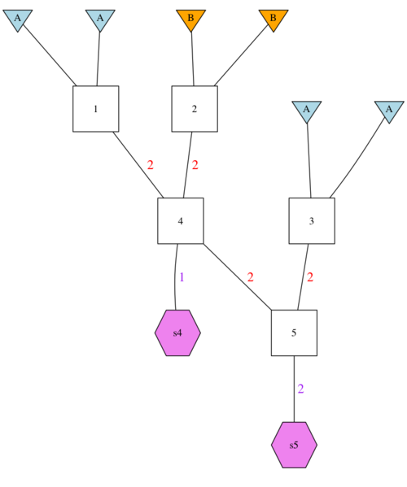

```{r, include = FALSE}
knitr::opts_chunk$set(
  collapse = TRUE,
  comment = "#>"
)
```

The first tutorial included a rather complex pedigree, mostly for testing
purposes.  Here we use a simpler pedigree, but apply it across multiple population
pairs in a more realistic example of the sort someone might want to do with `gscramble`.
This example comes out of Tim's work with understanding movement and introgression in 
feral pig populations in Missouri.


We start off by loading up some libraries.
```{r setup, message=FALSE, warning=FALSE}
library(gscramble)
library(tidyverse)
```


## `gsp3`: This vignettes' genomic permutation pedigree

The genomic permutation pedigree we will be using for this exercise is in the
R data object `gsp3`.  The package file at:
```{r eval=FALSE}
system.file("extdata/gsp3.csv", package = "gscramble")
```
holds a CSV file that gives the `GSP` tibble when read in using `readr::read_csv()`.
In picture form, it looks like this:



And it looks like this as an R-object:
```{r}
gsp3
```

## The individual meta data

We use the builtin package genotype data from pigs.  The relevant meta data from
the individuals in that data are in `I_meta`.  The first part of those meta data
look like:
```{r}
head(I_meta)
```

The number of different individuals in each group/population are as follows:
```{r}
I_meta %>%
  count(group)
```

Now, some of the samples from some of the groups are quite small, so we would
not want to consume too many individuals from each of those.  In order
to get many simulated samples of hybrid individuals it will be necessary to
do multiple simulations, but we can make each simulation count as much 
as possible by ensuring that one individual is consumed from each group.

Here we set up a RepPop that samples 2 individuals from every even group as being
from population A and 1
individual from every odd group as being from popuation B, leaving out Pop13.
And we add to that 2 individuals from every odd group from A and 1 from even even
group from B.  This means we consume 3 individuals from each population.
```{r}
rp1 <- bind_rows(
  tibble(
    rep = 1:6,
    pop = "A",
    group = str_c("Pop", seq(2,12,2))
  ),
  tibble(
    rep = 1:6,
    pop = "B",
    group = str_c("Pop", seq(1,11,2))
  ),
  tibble(
    rep = 7:12,
    pop = "B",
    group = str_c("Pop", seq(2,12,2))
  ),
  tibble(
    rep = 7:12,
    pop = "A",
    group = str_c("Pop", seq(1,11,2))
  )
) %>%
  arrange(rep, pop)

rp1
```

Such an arrangement will produce one simulation that includes 3 hybrid individuals
from each pair of populations in the same "rep".  But it will consume no more than
2 individuals from each even population and no more than one individual from each odd
population.  And no hybrids will be formed by any individuals from Pop13.

To segregate all those we would do:
```{r}
Segs <- segregate(tibble(gpp = list(gsp3), reppop = list(rp1)), RR = RecRates, MM = M_meta)
```

Then we might want to compute the admixture fraction for each individual,
just to check it out and make sure that we got it right:
```{r}
computeQs_from_segments(Segs)
```
That all checks out.

## Tying it back to the genos

Since we know the simulation-specific founder haplo index for everything, all we need now
is convert each of those into an absolute index in a matrix somewhere.  To deal with that
we need to formalize our system for putting individuals into a rows (or columns?) in a matrix.

This is still in development, and the following steps will not be seen, but this is
how it is shaping out.

First, we make a single data structure with the geno matrix (reformatted into 
halflotypes) and the meta data.
```{r}
GS <- rearrange_genos(G = Geno, Im = I_meta, Mm = M_meta)
```

Then, to each row in the Segs data frame we need to join onto it the absolute
column of the GS$G matrix that corresponds to the founder from which
that haplotype was taken.  
```{r}
Segs2 <- GS$I[[1]] %>%
  select(group, gs_column, abs_column) %>%
  left_join(Segs, ., by = c("group_origin" = "group", "sim_level_founder_haplo" = "gs_column"))
```

Now we must give each marker an absolute index, but then break those, along with the
positions into a list of tibbles/vectors that can be easily and quickly accessed.  Once we
have that we can do a summarize over each GPP sample that returns a list column that holds
a 2-column matrix subscriptor 

Here is the first step:
```{r}
m_list <- M_meta %>% mutate(chrom_f = factor(chrom, levels = unique(chrom)), idx = 1:n()) %>% select(-variant_id) %>% split(., f = .$chrom_f)
```

Now, we just need a function that we will call as a summarise function on a grouped tibble.  With things
being grouped by GPP sample (and ordered by chrom_f and segment start).  It will return a matrix whose first
column is the position of the marker and the second column is the absolute column of the founder
haplotype that the markers are being copied from. The function will look something like this:
```{r}
make_subscript_matrix <- function(n, chrom, start, end, abs_column, m_list, num_markers) {
  ret <- lapply(1:n, function(i) {
    the_chrom <- chrom[i]
    idxs <- m_list[[the_chrom]]$idx[ m_list[[the_chrom]]$pos > start[i] & m_list[[the_chrom]]$pos <= end[i] ]
    cbind(idxs, abs_column[i])
  }) 
  
  # here is a quick hack to deal with empty segments (i.e. those that have no markers in them)
  ret <- ret[sapply(ret, ncol) == 2]
  
  ret <- do.call(rbind, args = ret)
  
  # now do a quick check to make sure that every position is in there in the 
  # correct order
  stopifnot(all(ret[,1] == 1:num_markers))
  
  ret
}
```

So, to operate on Seg2 with this we do:
```{r}
pick_tib <- Segs2 %>%
  group_by(gpp, rep, ped_sample_id, samp_index, gamete_index) %>%
  summarise(m_subscript_matrix = list(make_subscript_matrix(n = n(),
                                                            chrom = chrom,
                                                            start = start,
                                                            end =  end,
                                                            abs_column = abs_column,
                                                            m_list = m_list, 
                                                            num_markers = nrow(GS$G[[1]]))))
```
For testing:

```{r, eval=FALSE}
Segs2 %>%
  summarise(m_subscript_matrix = list(make_subscript_matrix(n = n(),
                                                            chrom = chrom,
                                                            start = start,
                                                            end =  end,
                                                            abs_column = abs_column,
                                                            m_list = m_list, 
                                                            num_markers = nrow(GS$G[[1]]))))
  
```
Now, we can do some more error checking here to make sure that we haven't selected the same
SNP from the sample founder haflotype twice:
```{r}
full_mat <- do.call(rbind, pick_tib$m_subscript_matrix)

strs <- paste(full_mat[,1], full_mat[,2], sep = "--")
tab <- table(strs)
tab[tab>1]  # now positions are used twice

# then also check that each position was used 72 times
tab2 <- table(full_mat[, 1])
table(tab2)
# yep, that is what it should be

# now, check that each founder halflotype subscript is seen the same
# number of times
tab3 <- table(full_mat[, 2])
tab3
table(tab3)

# Cool! Everything checks out

```

And then for the last hurrah we grab all those alleles out of the GS$G matrix.  I think we can do it quickly like 
this:
```{r}
ped_sampled_indivs <- GS$G[[1]][full_mat] %>%
  matrix(nrow = dim(GS$G[[1]]))

```
That is freakishly fast too.  Good.

Now, we just need to deal with missing data.  
