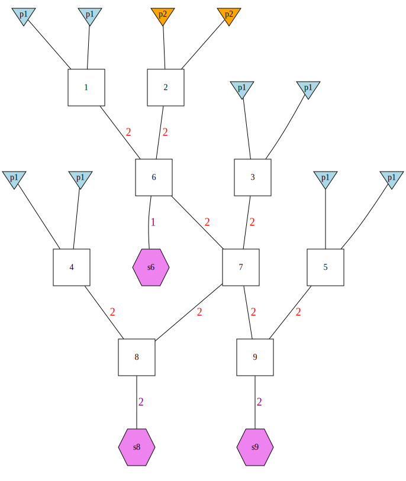
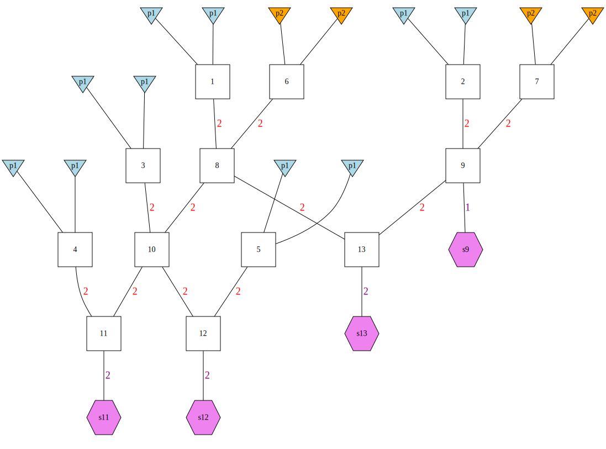

```{r setup, include = FALSE}
library(gscramble)
knitr::opts_chunk$set(
  collapse = TRUE,
  comment = "#>"
)

# determine if dot is on the system or not.  If we are running it on
# our own machines, with dot, then it will update the images. If dot is
# not on the system it will just use the stored dot images.
HasDot <- Sys.which("dot") != ""


# function to get the bits of the index
bits <- function(i) {as.logical(sapply(i,function(x){ as.logical(intToBits(x))}))[1:4]}

# a vector of the hybrid categories possible
classes <- c("F1", "F2", "F1B", "F1B2")

# a function to create (if dot is present) the figure for the i-th
# component of GSP_opts
make_plots <- function(i) {
  
  # get the section title for it
  section_title <- paste(
    "### ",
    #names(GSP_opts)[i],
    #":  ",
    paste(classes, " = ", bits(i), ", &nbsp;&nbsp;&nbsp;&nbsp; ", sep = "", collapse = "")
  )
  
  # make the plots if dot is installed
  if(HasDot) {
    gsp2dot(GSP_opts[[i]], paste("../man/figures/", i, sep=""))
  }
  
  # remove the dot and png files, that we do not need
  catch <- file.remove(paste("../man/figures/", i, c(".dot", ".png"), sep = ""))
  
  # now actually make the text for the sections
  ticks3 <- "```"
  sprintf("\n\n%s\n\n%s{r, echo=FALSE, out.width='100%%', fig.align='center'}\nknitr::include_graphics('../man/figures/%d.svg')\n%s", section_title, ticks3, i, ticks3)
}

# uncomment the following line and run in the console to get text for 
# all the sections:
#dump <- lapply(1:15, function(i) cat(make_plots(i)))
```

The function `create_GSP()` allows the user to quickly create several different
pedigree structures that are "saturated" in the sense of using all the genomic material
of the founders.  There are 15 different pedigrees, and they can be specified by the user
according to whether the user wants to have any of the following four hybrid categories
to be present amongst the simulated descendants:

* `F1`:  a first generation F1 hybrid---the product of mating between two parentals, one from
population p1 and the other from population p2.
* `F2`:  the product of a mating between two F1s
* `F1B`: an F1-backcross---the product of a mating between an F1 and a parental (non-admixed) individual
from population p1.
* `F1B2`: a second-generation F1-backcross---the product of a mating between an F1B and another parental
from population p1.

The following images show the pedigrees created by `create_GSP()` with different inputs (`TRUE` or `FALSE`)
for the four parameters, `F1`, `F2`, `F1B`, `F1B2`, to the function.  

See the documentation `?create_GSP` for more information.

###  F1 = TRUE, &nbsp;&nbsp;&nbsp;&nbsp; F2 = FALSE, &nbsp;&nbsp;&nbsp;&nbsp; F1B = FALSE, &nbsp;&nbsp;&nbsp;&nbsp; F1B2 = FALSE, &nbsp;&nbsp;&nbsp;&nbsp; 

```{r, echo=FALSE, out.width='100%', fig.align='center'}
knitr::include_graphics('../man/figures/1.svg')
```

###  F1 = FALSE, &nbsp;&nbsp;&nbsp;&nbsp; F2 = TRUE, &nbsp;&nbsp;&nbsp;&nbsp; F1B = FALSE, &nbsp;&nbsp;&nbsp;&nbsp; F1B2 = FALSE, &nbsp;&nbsp;&nbsp;&nbsp; 

```{r, echo=FALSE, out.width='100%', fig.align='center'}
knitr::include_graphics('../man/figures/2.svg')
```

###  F1 = TRUE, &nbsp;&nbsp;&nbsp;&nbsp; F2 = TRUE, &nbsp;&nbsp;&nbsp;&nbsp; F1B = FALSE, &nbsp;&nbsp;&nbsp;&nbsp; F1B2 = FALSE, &nbsp;&nbsp;&nbsp;&nbsp; 

```{r, echo=FALSE, out.width='100%', fig.align='center'}
knitr::include_graphics('../man/figures/3.svg')
```

###  F1 = FALSE, &nbsp;&nbsp;&nbsp;&nbsp; F2 = FALSE, &nbsp;&nbsp;&nbsp;&nbsp; F1B = TRUE, &nbsp;&nbsp;&nbsp;&nbsp; F1B2 = FALSE, &nbsp;&nbsp;&nbsp;&nbsp; 

```{r, echo=FALSE, out.width='100%', fig.align='center'}
knitr::include_graphics('../man/figures/4.svg')
```

###  F1 = TRUE, &nbsp;&nbsp;&nbsp;&nbsp; F2 = FALSE, &nbsp;&nbsp;&nbsp;&nbsp; F1B = TRUE, &nbsp;&nbsp;&nbsp;&nbsp; F1B2 = FALSE, &nbsp;&nbsp;&nbsp;&nbsp; 

```{r, echo=FALSE, out.width='100%', fig.align='center'}
knitr::include_graphics('../man/figures/5.svg')
```

###  F1 = FALSE, &nbsp;&nbsp;&nbsp;&nbsp; F2 = TRUE, &nbsp;&nbsp;&nbsp;&nbsp; F1B = TRUE, &nbsp;&nbsp;&nbsp;&nbsp; F1B2 = FALSE, &nbsp;&nbsp;&nbsp;&nbsp; 

```{r, echo=FALSE, out.width='100%', fig.align='center'}
knitr::include_graphics('../man/figures/6.svg')
```

###  F1 = TRUE, &nbsp;&nbsp;&nbsp;&nbsp; F2 = TRUE, &nbsp;&nbsp;&nbsp;&nbsp; F1B = TRUE, &nbsp;&nbsp;&nbsp;&nbsp; F1B2 = FALSE, &nbsp;&nbsp;&nbsp;&nbsp; 

```{r, echo=FALSE, out.width='100%', fig.align='center'}
knitr::include_graphics('../man/figures/7.svg')
```

###  F1 = FALSE, &nbsp;&nbsp;&nbsp;&nbsp; F2 = FALSE, &nbsp;&nbsp;&nbsp;&nbsp; F1B = FALSE, &nbsp;&nbsp;&nbsp;&nbsp; F1B2 = TRUE, &nbsp;&nbsp;&nbsp;&nbsp; 

```{r, echo=FALSE, out.width='100%', fig.align='center'}
knitr::include_graphics('../man/figures/8.svg')
```

###  F1 = TRUE, &nbsp;&nbsp;&nbsp;&nbsp; F2 = FALSE, &nbsp;&nbsp;&nbsp;&nbsp; F1B = FALSE, &nbsp;&nbsp;&nbsp;&nbsp; F1B2 = TRUE, &nbsp;&nbsp;&nbsp;&nbsp; 

```{r, echo=FALSE, out.width='100%', fig.align='center'}

```

###  F1 = FALSE, &nbsp;&nbsp;&nbsp;&nbsp; F2 = TRUE, &nbsp;&nbsp;&nbsp;&nbsp; F1B = FALSE, &nbsp;&nbsp;&nbsp;&nbsp; F1B2 = TRUE, &nbsp;&nbsp;&nbsp;&nbsp; 

```{r, echo=FALSE, out.width='100%', fig.align='center'}
knitr::include_graphics('../man/figures/10.svg')
```

###  F1 = TRUE, &nbsp;&nbsp;&nbsp;&nbsp; F2 = TRUE, &nbsp;&nbsp;&nbsp;&nbsp; F1B = FALSE, &nbsp;&nbsp;&nbsp;&nbsp; F1B2 = TRUE, &nbsp;&nbsp;&nbsp;&nbsp; 

```{r, echo=FALSE, out.width='100%', fig.align='center'}

```

###  F1 = FALSE, &nbsp;&nbsp;&nbsp;&nbsp; F2 = FALSE, &nbsp;&nbsp;&nbsp;&nbsp; F1B = TRUE, &nbsp;&nbsp;&nbsp;&nbsp; F1B2 = TRUE, &nbsp;&nbsp;&nbsp;&nbsp; 

```{r, echo=FALSE, out.width='100%', fig.align='center'}
knitr::include_graphics('../man/figures/12.svg')
```

###  F1 = TRUE, &nbsp;&nbsp;&nbsp;&nbsp; F2 = FALSE, &nbsp;&nbsp;&nbsp;&nbsp; F1B = TRUE, &nbsp;&nbsp;&nbsp;&nbsp; F1B2 = TRUE, &nbsp;&nbsp;&nbsp;&nbsp; 

```{r, echo=FALSE, out.width='100%', fig.align='center'}
knitr::include_graphics('../man/figures/13.svg')
```

###  F1 = FALSE, &nbsp;&nbsp;&nbsp;&nbsp; F2 = TRUE, &nbsp;&nbsp;&nbsp;&nbsp; F1B = TRUE, &nbsp;&nbsp;&nbsp;&nbsp; F1B2 = TRUE, &nbsp;&nbsp;&nbsp;&nbsp; 

```{r, echo=FALSE, out.width='100%', fig.align='center'}
knitr::include_graphics('../man/figures/14.svg')
```

###  F1 = TRUE, &nbsp;&nbsp;&nbsp;&nbsp; F2 = TRUE, &nbsp;&nbsp;&nbsp;&nbsp; F1B = TRUE, &nbsp;&nbsp;&nbsp;&nbsp; F1B2 = TRUE, &nbsp;&nbsp;&nbsp;&nbsp; 

```{r, echo=FALSE, out.width='100%', fig.align='center'}
knitr::include_graphics('../man/figures/15.svg')
```


