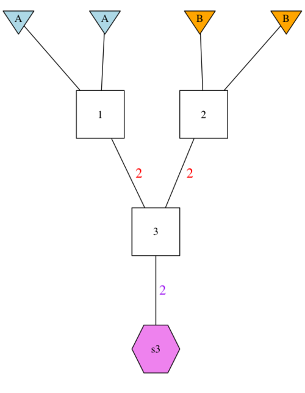

```{r, include = FALSE}
knitr::opts_chunk$set(
  collapse = TRUE,
  comment = "#>"
)
```

```{r setup}
library(gscramble)
library(tidyverse)
```

## Input Data

`gscramble` operates only for diploid species.  The main functions in `gscramble` require that genetic data
be provided in R objects (matrices/tibbles/etc.) with particular formatting.  We describe the formats of
those objects here.  Later we describe functions for reading data from PLINK (.ped / .map) format (and perhaps others,
in the future) into these necessary objects for `gscramble`.

The main required objects (loosely aligning with .bed/.fam/.bim file structure of binary PLINK files) are:

1. A matrix of genotype data (`Geno` as example data included with the package)
2. A tibble of meta data about the individuals in the genotype data (`I_meta`)
3. A tibble of meta data about the markers in the genotype data (`M_meta`)

On top of those, if you want to simulate hybrid individuals according to a pedigree, you will need
to provide:

4. A tibble that describes the rates of genetic recombination along the chromosomes (`RecRates`)
5. A tibble that describes a pedigree of interest within which sections of chromosomes are segregated down successive generations, which we call a "genome simulation pedigree" (`GSP`)
6. A tibble that translates the population specifiers in the pedigree (i.e., `GSP`) with the population/group labels associated with the genetic data (i.e., `I_meta`) for different hybridization replicates (`RepPop`)

Examples of these objects (which have been heavily downsampled to make them small enough to host on CRAN, illustrating 78 individuals genotyped at 100 loci distributed across 3 chromosomes [chr 12, 17, & 18] and sampled from 4 groups [Pop1, 2, 3, 4]) from a data set of invasive feral swine (Smyser et al. 2020; full dataset: https://datadryad.org/stash/dataset/doi:10.5061%2Fdryad.jsxksn05z) are included as data objects with the package. The following sections discuss each of these data inputs in detail.

For an example of how to read such data from PLINK files see [this section](#readplink).


### Matrix of genotype data.  `Geno`

The genotype data must be provided in a matrix.  If there are $N$ individuals and
$L$ loci in the diploid species, this matrix has $N$ rows and $2L$ columns.  Each
locus gets two adjacent columns (one allele in each column) and each individual gets one row.  For example,
in the first row and first column `Geno[1,1]` is the first allele for the first locus
for the first individual. In the first row and second column `Geno[1,2]` is the second
allele for the first locus for the first individual. In the first row and third column `Geno[1,3]`
is the first allele at the second locus for the first individual, and so on.  

Here is an example of data on the first 6 loci in the first 4 individuals from the
package data `Geno`:
```{r}
Geno[1:4, 1:12]
```

These data must be stored as a **character Matrix**.  Don't pass in a matrix of integers.
The alleles can be any characters whatsoever.  This allows the data to be microsatellites,
(`"112"`, `"116"`, etc), or microhaplotypes (`"ACCGA"`, `"ACCTC"`, etc.), or SNPs 
(`"A"`, `"C"`, `"G"`, `"T"`), etc.  If you do have a matrix of integers, named, for example
`IntMat`, you can coerce all the elements of that matrix to be characters without losing the
matrix shape of the data, by doing this:
```{r, eval=FALSE}
storage.mode(IntMat) <- "character"
```

Missing genotype data must be denoted by the standard R missing data
specifier, `NA`.  Don't go around calling missing data `"-1"` and expect
it to work properly!  Change those `"-1"`'s to `NA`s, or they will be 
regarded as an allelic type, rather than as missing data. If you do have missing data
that are denoted as `"-1"`, for example, then you can change all those `"-1"`'s to `NA`s using the following:

```{r}
Geno[Geno == "-1"] <- NA
```

Presently, since there are no `"-1"` entries in the `Geno` dataset, this line changes
nothing.

### Individual meta data. `I_meta`

This is a tibble that gives information about the individuals whose genotypes
are in `Geno`.  This can have many different columns if you want to have them,
but there must be at least two columns:

* `group`: a column that gives the character name of the group/cluster/population
that each individual is considered to be a part of. 
* `indiv`: a column that gives the character ID of each individual.

The number of rows of this tibble should be exactly equal to the number
of rows on `Geno` _and_ the order of individuals in `I_meta` must correspond
exactly to the order of individuals in `Geno`.

Here is what the first few rows of the example data's `I_meta` look like:
```{r}
head(I_meta)
```


### Marker meta data. `M_meta`

This input is a tibble of information about the markers in the `Geno` matrix.
It can have a variety of columns in it, but it is required to have three:

* `chrom`: the character name of the chromosome upon which the marker occurs.  For example, 
`"1"`, `"X"` or `"Omy28"`, or as illustrated in `M_meta` chr12, chr17, and chr18.  
**Importantly**, if you are simulating physical linkage with recombination, then
the names of the chromosomes in this file _must_ correspond _exactly_ to
the names of the chromosomes in `RecRates` (see next section).
* `pos`: a numeric (integer or double) column giving the position of the marker
(typically in base pairs, but it could be in arbitrary units that correspond to position 
units in `RecRates`), along the chromosome. These position values must be greater than 0.
* `variant_id`: a character vector of unique ID names for the markers. These should be
globally unique, i.e., don't have two markers on different chromosomes that are named the same
thing.

There must be exactly half as many rows in `M_meta` as there are columns in `Geno`, and the 
order of markers in `M_meta` must correspond exactly to the order of markers in the columns
in `Geno`.

Here are the first few rows of the example data `M_meta`:
```{r}
head(M_meta)
```
  

### Recombination rates. `RecRates`

This is a tibble that gives information about the rate of recombinations
in the genome.  This is necessary if simulating linked markers.  It is not required
in `gscramble` to know a crossover rate nor a recombination rate between every adjacent pair
of markers (though if you have that information, you can provide it in `RecRates`, [see below]).
Rather, the rate of recombination can be specified in terms of the 
per-meiosis probability of recombination in a number of (preferably relatively short---for
example, one megabase or less) bins. `RecRates` is a tibble which is required to have four columns:

* `chrom`: the chromosome on which the bin occurs. Note that the chromosome nomenclature
must match exactly that used in `M_meta`.
* `chrom_len`: the length of the chromosome. Yes, the value for each chromosome will typically
be duplicated on each 
row occupied by that `chrom`.
* `start_pos`: the starting position of the bin.  This will typically be a position along the
chromosome in base pairs, though this position can be in some other units, so long as it corresponds
to the position used in `M_meta`.
* `end_pos`: the ending position of the bin.
* `rec_prob`: the per-meiosis probability of a recombination occurring in the bin.
  

There are some important notes:

i. The start point of a bin should be 1 greater than the end point of the preceding bin.
ii. The positions of all the markers (in `M_meta`) should be included amongst the bin
intervals defined by `start_pos` and `end_pos`.  Most crucially in this regard, the
smallest `start_pos` should be less than the smallest `pos` in `M_meta` and the greatest
`end_pos` should be greater than or equal to the largest `pos` in `M_meta`. Otherwise, recombination
might never be possible between some pairs of markers in the data set.
iii. The chromosome length in `chrom_len` **must** exceed the position of every marker
on the chromosome in `M_meta`.  If this is not the case
then it would be possible that some markers would be dropped from the data set, possibly
with unexpected or bad results. You can check for errors in this
regard using the function `check_chrom_lengths()`.

```{r}
head(RecRates)
```


### Genome Simulation Pedigree. `GSP`

The `GSP` is a specification of a pedigree within which sections of chromosome 
will get segregated across the successive generations represented within the pedigree
and is used to to guide sampling of these chromosomal sections without replacement. 
This will allow us to  characterize/simulate hybrid individuals for the purpose 
of assessing the power to classify individuals to hybrid classes of interest 
(i.e., F1s, F1BC1s, F2BC1s, etc.).

The `GSP` must be a tibble in which each individual has a numeric identifier 
(from 1 up to the number of individuals in the pedigree). Founders are listed directly
(1…nFounders) whereas numbers can represent more than one individual in successive
generations (e.g., two F1 individuals sampled within the most basic pedigree 
illustrated below are characterized as ‘3’).  The founders' parents are listed
as NA whereas non-founders have parents listed.  Founders' haplotypes must have unique IDs
and must originate from a specified population (typically given in capital letters.) 
Individuals can be sampled from individuals in the pedigree, and it is up to the user
to indicate how many gametes must be segregated to each individual (from each of its
two parents) in order to consume all the genetic material present among the founders.

This probably sounds a little abstract, and, indeed, it is.  To demonstrate, `gscramble` includes
15 basic GSPs (illustrated within the object `GSP_opts`) that can be retrieved by 
specifying the types of individuals of interest with the function `create_GSP()`.
As we will illustrate below, you are not restricted to these GSP configurations.
These 15 specific GSP configurations were of interest to the authors and are included
to illustrate how to structure GSP tibbles that may be of interest to you. 

To try to explain the GSP concept more fully, we will first draw a picture of the
most basic pedigree (the simulation of F1s created through the hybridization of 
individuals from two populations).  We then show the tibble representation of that
same GSP and discuss the structure of a GSP in light of those two pieces of information.
```{r, fig.align='center', out.width='50%', echo = FALSE}

```

Let's develop this basic example of simulating F1 hybrids.  The first step would be to define the GSP in which we are describing sources as ‘p1’ and ‘p2’, and then we will need an associated `RepPop` to represent the two
different populations the founders belong to.    

```{r}
gspF1 <- create_GSP(pop1 = "p1", pop2 = "p2", F1 = TRUE)

gspF1
```

To accompany this GSP, we next need to define the groups 
that we are interested in hybridizing - in this case Pop1 and Pop2 - with a `RepPop` tibble.

We will fully describe `RepPop` tibbles below.  However, GSPs need to be accompanied
by a `RepPop` tibble that defines the groups to be hybridized.  Accordingly, let's lightly introduce 
the `RepPop` object here by specifying the tibble that accompanies this F1 GSP.   


```{r}
Pattern = c("Pop1", "Pop2")
RepPopSimpleF1 <- tibble(
  index = rep(1:1, each = 2),
  pop = rep(c("p1", "p2"), times = 1),
  group = Pattern
)
RepPopSimpleF1
```

Please note that F1s are symmetrical, such that a Pop1-Pop2 F1 hybrid is identical to a Pop2-Pop1 F1 hybrid.
This will not be the case as we continue developing more complex GSPs that include backcrossed hybrids. 

This simplistic example specifies F1 hybrids between Pop1 and Pop2.  If we want to  
add a little more complexity working within the same GSP, we could modify the
`RepPop` tibble to simulate hybrids between Pop1 and all other populations.

```{r}
Pattern = c("Pop1", "Pop2", "Pop1",
            "Pop3", "Pop1", "Pop4")
RepPopSimpleF1_b <- tibble(
  index = rep(1:3, each = 2),
  pop = rep(c("p1", "p2"), times = 3),
  group = Pattern
)
RepPopSimpleF1_b
```

Or, perhaps, let’s say you are interested in simulating F1 hybrids for all pairwise
combinations of populations (with the example data Pop1, Pop2, Pop3, Pop4).  
Accordingly, we need to specify the `RepPop` tibble to define which populations 
to use in each replicate of the simulation:

```{r}
Pattern = c("Pop1", "Pop2", "Pop1", "Pop3", "Pop1", "Pop4", 
            "Pop2", "Pop3", "Pop2", "Pop4", "Pop3", "Pop4")
RepPopSimpleF1_c <- tibble(
  index = rep(1:6, each = 2),
  pop = rep(c("p1", "p2"), times = 6),
  group = Pattern
)
head(RepPopSimpleF1_c)

```


Building upon this simplistic GSP, let’s define something a little more ‘complex’ with F1s, F1BC1s, and F1BC2s.  
Start by using the built-in function `create_GSP()`.

```{r}
gspComplex <- create_GSP(
  pop1 = "p1", 
  pop2 = "p2", 
  F1 = TRUE, 
  F1B = TRUE, 
  F1B2 = TRUE
)

gspComplex
```

For this example, Pop1 is our population of interest. We are simulating Pop1-Pop2 F1s, then pairing those F1 individuals with Pop1 to generate backcrossed hybrids.  Note that these simulated F1B1s and F1BC2 are different than hybrids formed from Pop1-Pop2 F1s that are backcrossed to Pop2. Here is a picture of what this example would look like:

```{r, fig.align='center', out.width='100%', echo = FALSE}
knitr::include_graphics("../man/figures/13.svg")
```


If we are interested in F1 hybrids between Pop 1 and each of the other populations 
(Pop2, Pop3, or Pop4), as well as two generations of backcrossing to each of those
populations, we can use a `RepPop` tibble that looks like this:

```{r}
Pattern = c("Pop1", "Pop2", "Pop1", 
            "Pop3", "Pop1", "Pop4")
RepPopComplex1 <- tibble(
  index = rep(1:3, each = 2),
  pop = rep(c("p1", "p2"), times = 3), 
  group = Pattern
)
RepPopComplex1
```


We will go over more examples of how to define populations in `RepPop` in the section "Mapping populations/collections to founding populations. `RepPop`" of this tutorial.
But for now, let's examine GSPs further.

In our previous examples, we specified an initial suite of GSPs that were of interest, combining various configurations of F1s, F2s, F1BC1s, and F1BC2s using the `create_GSP()` function.  However, you are not limited to these GSPs and may create your own.  

Here are two illustrations of more complex patterns of hybridization:

The package data object `GSP` shows an example of a genome simulation pedigree with 13 members.  Here is a picture of what it looks like:

```{r, fig.align='center', out.width='100%', echo = FALSE}
knitr::include_graphics("../man/figures/13-member-ped.svg")
```

You can produce this type of plot using the `gsp2dot()` function
in the 'gscramble' package, as follows, but it requires the installation of the GraphViz `dot` software.

```{r eval=FALSE}
csv <- system.file("extdata/13-member-ped.csv", package = "gscramble")
gsp_tib <- readr::read_csv(csv)
paths <- gsp2dot(g = gsp_tib, path = "images/13-member-ped")
# now, get rid of the dot and png files
file.remove(paths[1:2])
```

The tibble specification of that same GSP is printed here:

```{r}
GSP
```

and, a CSV file with the same table in it can be found using:

```{r, eval=FALSE}
system.file("extdata/13-member-ped.csv", package = "gscramble")
```

### A four-population GSP. `gsp4`

Or, alternatively, let’s say you are interested in patterns of hybridization that are not restricted to simply two populations. 

For illustration, we will have another pedigree that represents an F1 between 
populations A and B then mating with an F1 from populations C and D.  The tibble
is available in the package data object `gsp4`, while the CSV file of it is
available at:

```{r eval=FALSE}
system.file("extdata/gsp4.csv", package = "gscramble")
```

Here is what it looks like:

```{r, fig.align='center', out.width='70%', echo = FALSE}
knitr::include_graphics("../man/figures/gsp4-700.png")
```


### Mapping populations/collections to founding populations. `RepPop`

When you create a genomic simulation pedigree, you will typically denote the
groups/populations/clusters that the founders come from with short names, like "A" or "B".
However, the actual group names used in your genotype dataset (as specified in `I_meta`) might be different. In our example
data for this R package, we have 4 groups.  To quickly illustrate how many individuals are included
in each of these example groups:

```{r}
I_meta %>%
  count(group)
```

To define how individuals among groups combine to form hybrids, you must use a tibble
with columns `index`, `pop`, `group`, to indicate which of the founding
populations ("A", "B", etc.) correspond to the different groups (from the `group` column in, for example,
`I_meta`) in your genotype data set; thus, the `RepPop` serves to translate/align your `I_meta` with your `GSP`.

Because it is quite likely that you might wish to iterate the segregation procedure multiple
times in a single simulation, you can specify that by doing multiple replicates of the
procedure as defined in the `index` column (1:nReplicates). 

An example might help.  Suppose that we wish to do a simulation with the pedigree in `GSP` (13 individuals,
6 of which are founders: 3 from population "A" and 3 from population "B").  For the first replicate (`index` = 1), we might want
to map "A" to Pop1 and "B" to Pop2, and in the second replicate (`index` = 2) we might want to map "A" to Pop4, and "B" to
Pop 3.  (Note, at this point, genetic material from 3 individuals from each of those populations will have
been "consumed" from each of these populations and segregated, without replacement, into the samples from the
genomic simulation pedigree.)


The `RepPop` tibble that would specify this is given in the package variable `RepPop1`:

```{r}
RepPop1
```

For another example, imagine that we want to do three replicates (`index` = 1:3) creating the
admixed individuals sampled from the genomic permutation pedigree, `gsp4`.
The RepPop tibble for that might look like this:

```{r}
RepPop4
```

Note that this request will consume one individual from each of populations 1, 2, 3, and 4 (which are mapped to A, B, C, and D, respectively), and will simulate/create 4 admixed individuals.


## Segregating Chunks of Genome Without Replacement

Now that we have been through all the input data formats, we can
use them to segregate chunks of chromosome.  Note that this first part
does not require genotypes.  We are just simulating the process by which big chunks 
of chromosomes drop through the pedigrees. The function used for this
is `segregate()`. The needed inputs are:

* 1 or more genomic permutation pedigrees (like `GSP` or `gsp4`)
* A RepPop tibble to go with each genomic permutation pedigree
* The recombination probabilities, like `RecRates`.

The final wrinkle here is that we have set this up so that you
can specify, in a single simulation, that replicates from
multiple genomic permutation pedigrees can be requested. 
This is done by passing `segregate()` a tibble that has a
list column named `gpp`, which holds the genomic permutation pedigrees,
and a parallel column named `reppop`, which holds the RepPop tibbles for each 
of those genomic permutation pedigrees.  

But, let's start simple, specifying only a reasonably simple genomic permutation pedigrees (gspComplex) and a `RepPop` tibble
with Pop1 as the focal group (in backcrosses), hybridizing with Pop2.  The tools
described below are not that interesting for the most simplistic GSP (gspF1) in that 
the simulation of F1s does not provide the opportunity to illustrate recombination.
Accordingly, we are illustrating `segregate()` with the slightly more complex gspComplex, producing
F1s, F1BC1s, F2BC1s ...

```{r}
Input_tibble <- tibble(
  gpp = list(gspComplex),
  reppop = list(RepPopSimpleF1)
)

# here is what that input object looks like:
Input_tibble
```

The segregation requested is then carried out, using the recombination
rates in `RecRates` like this:

```{r}
set.seed(15) # for reproducibility
Segments <- segregate(
  request = Input_tibble,
  RR = RecRates
)
```

The output from that is a big tibble.  Each row represents one segment of genetic
material amongst the sampled individuals from the genomic permutation pedigrees.
Each segment exists in one of the samples (`samp_index`) from a sampled individual
with a `ped_sample_id` on a given `gpp` (the index giving the row of the request input tibble)
in a given `rep` within the individual.  Further, it is on one of two gametes
(`gamete_index`) that segregated into the individual, and it came from a certain founding
population (`pop_origin`) that corresponds to the named groups in the genotype file (`group_origin`).
And, of course, the segment occupies the space from `start` to `end` on a chromosome `chrom`.
Finally, the index of the founder haplotype on the given gpp that this segement descended from is
given in `rs_founder_haplotype` which is short for "rep-specific founder haplotype".  This final
piece of information is crucial for segregating variation from the individuals in the `Geno` file
onto these segments.  We take that up in the next section, but let's first look at the results
that we have here.

First, here is a listing of the top of the `Segments` we produced above.  

```{r}
Segments
```

The table is a little wide, so we will show the first half of the columns and then 
the second half here.

First half

```{r}
Segments %>%
  select(gpp:pop_origin)
```

Second half

```{r}
Segments %>%
  select(rs_founder_haplo:group_origin)
```

### Visualizing those chunks of genome

Let's glance at the gspComplex (also illustrated above):

```{r, fig.align='center', out.width='100%', echo = FALSE}
knitr::include_graphics("../man/figures/13.svg")
```

We have a convenience function called `plot_simulated_chromosome_segments()` that
let's you quickly visualize the results. Let's try it here.  By adding the RecRates
to the function call, we get little sparklines showing us the recombination rates across the
chromosomes.

```{r, fig.width=7.5, fig.height=9}
g <- plot_simulated_chromomsome_segments(Segments, RecRates)
g
```

As you can see, Individual #5 (F1 specified in the GSP above) represents full chromosomes from Pop1 and Pop2, without recombination, at each of the 3 chromosomes included in the example data.
As described in the GSP, one of the F1s was carried down the pedigree to simulate an F1BC1 (Individual #6).  
The chromosomal composition of Individual 6 illustrates the effect of recombination.  
Similarly, one of the F1BC1s was carried down to simulate an F1BC2 (Individuals #7).  Here we have two #7s, illustrating distinct patterns of recombination.  

## Simulating alleles at markers within segments

There are a few separate steps required to make this happen, and they all occur
within the function `segments2markers()`.  The steps that happen are:

1. The genotype matrix is reorganized according to the `group` specification
in the `I_meta`, so that individuals in the same group are adjacent to one another
in the genotype matrix.
2. The alleles carried by the individuals within each population are permuted.
3. The chromosomes carrying these permuted alleles from `Geno` are mapped to the
chromosomes carried by the founders in the simulation performed by `segregate()`. 
4. The alleles on the founder chromosomes are propagated to the descendant segments
in the individuals sampled from the GSP.
5. Missing data is dealt with (if a site has one gene copy missing after the permutation
and mapping described above, the other gene copy must be declared missing, as well).
6. The output genotypes are formatted for return, along with some information about
the true admixture proportions of each individual.

The input to `segments2markers()` is:

* A tibble of segments, like that returned from `segments()`.  This is the variable
`Segments` defined above in this vignette example,
* The individual meta data,
* The marker meta data,
* The genotype data.

We invoke it like this:
```{r}
Markers <- segments2markers(
  Segs = Segments,
  Im = I_meta,
  Mm = M_meta,
  G = Geno
)
```

The output is a list of three components:

* `Markers$ret_geno` is an N x 2L matrix of returned genotypes. The two alleles at each
    locus are in two adjacent columns.
    ```{r}
    dim(Markers$ret_geno)
    ```
    ```{r}
    # genotypes of the first 10 individuals at the first 3 markers
    Markers$ret_geno[1:10, 1:6]
    ```
* `$ret_ids`: a tibble with IDs of the individuals corresponding to the rows
    in the `ret_geno` matrix.  
  
    ```{r}
    # Individual IDs for the first 10 individuals
    Markers$ret_ids[1:10,]
    ```


    There are two columns: `group` and `indiv`.  The first
    rows include the samples simulated as specified in the GSP.  Their group is `ped_hybs` (meaning
    "sampled hybrids from the pedigree") and their IDs are in the `indiv` column in the
    format of an `h-` followed by a string with replaced values of: `gpp-rep-ped_sample_id-samp_index-matrix_row`.
    Let's break down the nomenclature we used to label simulated gentype.  Recall with this
    simulation, we specified only a single `GSP` (in the Input_tibble gpp = list(gspComplex).  
    With this `gspComplex`, we are using 3 founders from Pop1 and 1 founder from Pop2
    to simulate one F1 (Individual #5 as described with `gspComplex` above), one F1BC1
    (Individual #6) and two F1BC2s (Individual #7).  Within the illustration of `gspComplex`,
    as called from the Input_tibble...
    
    Those are:
    - `index`: the `index` value from the `RepPop` object (only a single `index` in this example)
    - `ped`: the number corresponding to the unique GSP used in the simulation (recall that you can specify multiple GSPs by passing `segregate()` a
list named `gpp` which holds the genomic permutation pedigrees used in the simulation, but we only passed 1 GSP in that list),
    - `sample_id`: corresponding sample number from the GSP (recall that multiple individuals simulated within the pedigree [non-founders] may share the same sample number, but these
    IDs correspond to #5, #6, and two #7s with `gspComplex`)
    - `samp_index`: indexing of individuals within `sample_id`s (one #5[F1], one #6 [F1BC1], and two #7s [F1BC2])
    - `matrix_row`: the row number of the genotype matrix
    
    After the individual hybrid samples from the pedigree, there are rows of all the
    remaining individuals whose genotypes after permutation were not involved as
    founders in the segregation simulation.  These are given the name `permed` + their
    original IDs.  The group that each belongs to is in the group column.  Things are
    organized this way so that the whole genotype can easily be passed to ADMIXTURE and the
    admixture fractions of the hybrid individuals estimated using the `permed_*` individuals
    as samples of known cluster/group origin.
* `$hyb_Qs`: A tibble with the true admixture fraction (calculated as the total proportion
    of genome length from each group) of each simulated hybrid.
    

Now, briefly, we can illustrate this again with more complexity.  Let's illustrate the capacity to simulate
multiple genomic permutation pedigrees (GSP and gsp4 illustrated below)  by passing `segregate()` a tibble that has a
list column named `gpp`, which holds the genomic permutation pedigrees,
and a parallel column named `reppop`, which holds the RepPop tibbles for each 
of those genomic permutation pedigrees.  

```{r}
Input_tibble <- tibble(
  gpp = list(GSP, gsp4),
  reppop = list(RepPop1, RepPop4)
)

# here is what that input object looks like:
Input_tibble
```

```{r}
set.seed(15) # for reproducibility
Segments <- segregate(
  request = Input_tibble,
  RR = RecRates
)
```    

```{r, fig.width=7.5, fig.height=9}
g <- plot_simulated_chromomsome_segments(Segments, RecRates)
g
```

```{r}
Markers <- segments2markers(
  Segs = Segments,
  Im = I_meta,
  Mm = M_meta,
  G = Geno
)
```


## Back to plink format

Now that we have illustrated the application of gscramble with this simple dataset 
and the included R objects `Geno`, `I_meta`, and `M_meta`, you are probably eager to try
gscramble with data of your own.  Use the function `plink2gscramble()` to directly input 
genotypes in the PLINK (.ped / .map) format.  You must pass the function `plink2gscramble()`
both the .ped and corresponding .map files as illustrated below.  If your data is in a binary
PLINK format (.bed / .bim / .fam), first use PLINK (option `--recode`) to export
.ped and .map files that are accessible for gscramble's `plink2gscramble()`.

```{r}

# with .ped / .map files

plinkIN <- plink2gscramble(ped = "gscrambleTutorial.ped", map = "gscrambleTutorial.map")
ls(plinkIN)
str(plinkIN)

dim(plinkIN$Geno)
plinkIN$Geno[1:3,1:10]

rm(plinkIN)

# identifical result with corresponding .ped.gz / .map.gz files

map_plink <- system.file("extdata/example-plink.map.gz", package = "gscramble")
ped_plink <- system.file("extdata/example-plink.ped.gz", package = "gscramble")

plinkIN <- plink2gscramble(map_plink, ped_plink)
dim(plinkIN$Geno)
dim(plinkIN$I_meta)
dim(plinkIN$M_meta)

```


```{r}


# will likely want to write the results to a directory in your
# home directory somewhere, like `prefix = ~/my_stuff/gscram-sim-1`, etc.
tfile <- tempfile()
gscramble2plink(
  I_meta = Markers$ret_ids,
  M_meta = M_meta,
  Geno = Markers$ret_geno,
  prefix = tfile
)
```


```{r}
# note, we are only using a temporary file here for the output
# because this is in the vignette of an R package.  You, yourself,
# will likely want to write the results to a directory in your
# home directory somewhere, like `prefix = ~/my_stuff/gscram-sim-1`, etc.
tfile <- tempfile()
gscramble2plink(
  I_meta = Markers$ret_ids,
  M_meta = M_meta,
  Geno = Markers$ret_geno,
  prefix = tfile
)
```

