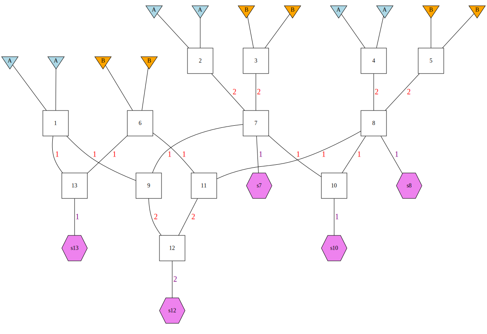

```{r, include = FALSE}
knitr::opts_chunk$set(
  collapse = TRUE,
  comment = "#>"
)
```

```{r setup}
library(gscramble)
library(tidyverse)
```

## Input Data

`gscramble` operates only for diploid species.  The main functions in `gscramble` require that genetic data
be provided in R objects (matrices/tibbles/etc.) with particular formatting.  We describe the formats of
those objects here.  Later we describe functions for reading data from PLINK format (and perhaps others,
in the future) into these necessary objects for `gscramble`.

The main required objects are:

1. A matrix of genotype data. (`Geno`)
2. A tibble of meta data about the individuals in the genotype data (`I_meta`)
3. A tibble of meta data about the markers in the genotype data (`M_meta`)

On top of those, if you want to simulate hybrid individuals according to a pedigree, you might
also need to provide

4. A tibble that describes the rates of genetic recombination along the chromosomes. (`RecRates`)
5. A tibble that describes a pedigree for gene dropping chromosome chunks, which we call
a "genome simulation pedigree" (`GSP`)
6. A tibble that matches the population specifiers in the pedigree with those in the
genetic data for different replicates (`RepPop`)


Examples of these objects from a data set of feral pigs (CITATION) are included as data objects with the 
package. The following sections discuss each of these data inputs in detail.

### Matrix of genotype data.  `Geno`

The genotype data must be provided in a matrix.  If there are $N$ individuals and
$L$ loci in the diploid species, this matrix has $N$ rows and $2L$ columns.  Each
locus gets two adjacent columns and each individual gets one row.  So, for example,
in the first row and first column is the allelic type of the first of two gene copies in 
the first individual at the first locus. In the first row and second column is the second
of two gene copies in the first individual and first locus.  In the first row and third column
is the first gene copy at the second locus in the first individual, and so on.  

Here is an example of data on the first 6 loci in the first 4 individuals from the
package data `Geno`:
```{r}
Geno[1:4, 1:12]
```

These data must be stored as a **character Matrix**.  Don't pass in a matrix of integers.
The alleles can be any characters whatsoever.  This allows the data to be microsatellites,
(`"112"`, `"116"`, etc), or microhaplotypes (`"ACCGA"`, `"ACCTC"`, etc.), or SNPs 
(`"A"`, `"C"`, `"G"`, `"T"`), etc.  If you do have a matrix of integers, named, for example
`IntMat` you can coerce all the elements of that matrix to be characters, without losing the
matrix shape of the data, by doing this:
```{r, eval=FALSE}
storage.mode(IntMat) <- "character"
```

Missing genotype data must be denoted by the standard R missing data
specifier, `NA`.  Don't go around calling missing data `"-1"` and expect
it to work properly!  Change those `"-1"`'s to `NA`s, or they will be 
regarded as an allelic type, rather than as missing data.


### Individual meta data. `I_meta`

This is a tibble that gives information about the individuals whose genotypes
are in `Geno`.  This can have many different columns if you want to have them,
but there must be at least two columns:

* `group`: a column that gives the character name of the group/cluster/population
that each individual is considered to be a part of. 
* `indiv`: a column that gives the character ID of each individual.

The number of rows of this tibble should be exactly equal to the number
of rows on `Geno` _and_ the order of individuals in `I_meta` must correspond
exactly to the order of individuals in `Geno`.

Here is what the first few rows of the example data's `I_meta` look like:
```{r}
head(I_meta)
```


### Marker meta data. `M_meta`

This input is a tibble of information about the markers in the `Geno` matrix.
It can have a variety of columns in it, but it is required to have three:

* `chrom`: the character name of the chromosome upon which the marker occurs.  For example, 
`"1"` or `"X"` of `"Omy28"`.  **Importantly**, if you are simulating physical linkage with 
recombination, then the names of the chromosomes in this file _must_ correspond _exactly_ to
the names of the chromosomes in `RecRates` (see next section).
* `pos`: a numeric (integer or double) column giving the position of the marker
(typically in base pairs, but it could be in arbitrary units that correspond to position 
units in `RecRates`), along the chromosome. These position values must be greater than 0.
* `variant_id`: a character vector of unique ID names for the markers. These should be
globally unique, i.e., don't have two markers on different chromosomes that are named the same
thing.

There must be exactly half as many rows in `M_meta` as there are columns in `Geno`, and the 
order of markers in `M_meta` must correspond exactly to the order of markers in the columns
in `Geno`.

Here are the first few rows of the example data `M_meta`:
```{r}
head(M_meta)
```
  

### Recombination rates. `RecRates`

This is a tibble that gives information about the rate of recombinations
in the genome.  This is necessary if simulating linked markers.  It is not required
in `gscramble` to know a crossover rate nor a recombination rate between every adjacent pair
of markers (though if you have that information, you can provide it in `RecRates`, (see below).
Rather, the rate of recombination can be specified in terms of the 
per-meiosis probability of recombination in a number of (preferably relatively short---for
example, 1 Mb or less) bins. `RecRates` is a tibble which is required to have four columns:

* `chrom`: the chromosome on which the bin occurs. Note that the chromosome nomenclature
must match exactly that used in `M_meta`.
* `chrom_len`: the length of the chromosome. Yes, the value for each chromosome will typically
be duplicated on each 
row occupied by that `chrom`.
* `start_pos`: the starting position of the bin.  This will typically be a position along the
chromosome in base pairs, though this position can be in some other units, so long as it corresponds
to the position used in `M_meta`.
* `end_pos`: the ending position of the bin.
* `rec_prob`: the per-meiosis probability of a recombination occurring in the bin.
  

There are some important notes:

i. The start point of a bin should be 1 greater than the end point of the preceding bin.
ii. The positions of all the markers (in `M_meta`) should be included amongst the bin
intervals defined by `start_pos` and `end_pos`.  Most crucially in this regard, the
smallest `start_pos` should be less than the smallest `pos` in `M_meta` and the greatest
`end_pos` should be greater than or equal to the largest `pos` in `M_meta`. Otherwise, recombination
might never be possible between some pairs of markers in the data set.
iii. The chromosome length in `chrom_len` **must** exceed the position of every marker
on the chromosome in `M_meta`.  If this is not the case
then it would be possible that some markers would be dropped from the data set, possibly
with unexpected or bad results. **(HEY TEAM!  LET'S WRITE A FUNCTION THAT CHECK THIS CALLED,
`check_chrom_lengths()` or something).**


### Genome Simulation Pedigree. `GSP`

The `GSP` is a specification of a pedigree down which sections of chromosome 
will get segregated to guide the sampling without replacement of genetic material
into  hybrid individuals for the purpose of assessing the power for identifying
these individuals.

The `GSP` must be a tibble in which each individual has a numeric identifier (from
1 up to the number of individuals in the pedigree.) The founders' parents are listed
as NA and non-founders have parents listed.  Founders' haplotypes must have unique IDs
and must originate from a specified population (typically given in capital letters.) 
Individuals can be sampled from individuals in the pedigree.  

**This needs more explanation **

The package data object `GSP` shows an example of such a genome simulation pedigree.  It is
a fairly complex pedigree with 13 members.  **NOTE: Eric needs to write some functions
that operate on a GSP and verify it is valid.  Until that time, users are encouraged
to check them visually (more on that later...)**.  Here is how we created the
images for this vignette:
```{r eval=FALSE}
csv <- system.file("extdata/13-member-ped.csv", package = "gscramble")
gsp_tib <- readr::read_csv(csv)
paths <- gsp2dot(g = gsp_tib, path = "images/13-member-ped")
# now, get rid of the dot and png files
file.remove(paths[1:2])
```
holds a CSV file that gives the `GSP` tibble when read in using `readr::read_csv()`.

Here is an image of the data object `GSP` drawn as a genome simulation pedigree.
You can produce this type of plot using the `gsp2dot()` function
in the 'gscramble' package,
but it requires the installation of the GraphViz `dot` software. Working with this
is described in a different vignette.
```{r, fig.align='center', out.width='100%', echo = FALSE}

```

### A four-poplation GSP. `gsp4`

For illustration, we will have another pedigree that represents an F1 between 
populations A and B then mating with an F1 from populations C and D.  The tibble
is available in the package data object `gsp4`, while the CSV file of it is
available at:
```{r eval=FALSE}
system.file("extdata/gsp4.csv", package = "gscramble")
```

Here is what it looks like:


### Mapping populations/collections to founding populations. `RepPop`

When you create a genomic simulation pedigree, you will typically denote the
populations that the founders come from with short names, like "A" or "B".  However,
the actual populations in your genotype data set might be different.  For example,
in our example data in this R package, we have groups of individuals given
in `I_meta`.  Here we count up how many individuals in each of these groups/populations/clusters
there are:
```{r}
I_meta %>%
  count(group)
```

You must use a tibble with columns `rep`, `pop`, `group`, to indicate which of the founding
populations ("A", "B", etc.) correspond to the different groups (from the `group` column in, for example,
`I_meta`) in your genotype data set.
Because it is quite likely that you might wish to iterate the segregation procedure multiple
times in a single simulation, you can specify that by doing multiple "reps" (replicates) of the
procedure. 

An example might help.  Suppose that we wish to do a simulation with the pedigree in `GSP` (13 individuals,
6 of which are founders: 3 from population "A" and 3 from population "B").  For the first rep, we might want
to map "A" to Pop1 and "B" to Pop2, and in the second rep we might want to map "A" to Pop10, and "B" to
Pop 5.  (Note, at this point, genetic material from 3 individuals from each of those populations will have
been "consumed" from each of these populations and segregated, without replacement, into the samples from the
genomic simulation pedigree.)


The RepPop tibble that would specify this is given in the package variable `RepPop1`:
```{r}
RepPop1
```

For another example, imagine that we want to do three replicates creating the
admixed individuals sampled from the genomic permutation pedigree, `gsp4`.
The RepPop tibble for that might look like this:
```{r}
RepPop4
```
Note that this request will consume 1 individual from each of populations 1-12,
and will create 12 simulated, admixed, individuals.

## Segregating Chunks of Genome Without Replacement

Now that we have been through all the input data formats, we can
use them to segregate chunks of chromosome.  Note that this first part
does not require the genotypes.  We are just simulating big chunks of 
chromosome dropping through the pedigrees. The function used for this
is `segregate()`. The needed inputs are:

* 1 or more genomic permuation pedigrees (like `GSP` or `gsp4`)
* A RepPop tibble to go with each genomic permutation pedigree
* The recombination probabilities, like `RecRates`.

The final wrinkle here is that we have set this up so that you
can specify, in a single simulation, that replicates from
multiple genomic permutation pedigrees can be requested. 
This is done by passing `segregate()` a tibble that has a
list column named `gpp` that holds the genomic permutation pedigrees,
and a parallel column named `reppop` that holds the RepPop tibbles for each 
of those genomic permutation pedigrees.  Let's
see that by an example, building on the two examples above:
```{r}
Input_tibble <- tibble(
  gpp = list(GSP, gsp4),
  reppop = list(RepPop1, RepPop4)
)

# here is what that input object looks like:
Input_tibble
```

The segregation requested is then carried out, using the recombination
rates in `RecRates` like this:
```{r}
set.seed(15) # for reproducibility
Segments <- segregate(
  request = Input_tibble,
  RR = RecRates
)
```

The output from that is a big tibble.  Each row represents one segment of genetic
material amongst the sampled individuals from the genomic permutation pedigrees.
Each segment exists in one of the samples (`samp_index`) from a sampled individual
with a `ped_sample_id` on a given `gpp` (the index giving the row of the request input tibble)
in a given `rep` within the individual.  Further, it is on one of two gametes
(`gamete_index`) that segregated into the individual, and it came from a certain founding
population (`pop_origin`) that corresponds to the named groups in the genotype file (`group_origin`).
And, of course, the segment occupies the space from `start` to `end` on a chromosome `chrom`.
Finally, the index of the founder haplotype on the given gpp that this segement descended from is
given in `rs_founder_haplotype` which is short for "rep-specific founder haplotype".  This final
piece of information is crucial for segregating variation from the individuals in the `Geno` file
onto these segments.  We take that up in the next section, but first we will look at the results
that we have here.

First, here is a listing of the top of the `Segments` we produced above.  
```{r}
Segments
```
The
table is a little wide, so we will show the first half of the columns and then 
the second half here.

First half
```{r}
Segments %>%
  select(gpp:pop_origin)
```

Second half
```{r}
Segments %>%
  select(rs_founder_haplo:group_origin)
```

