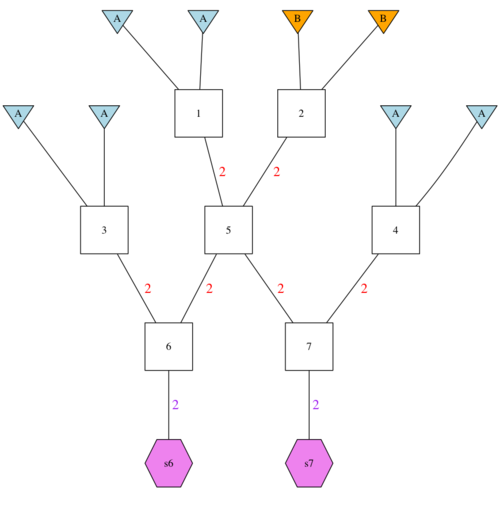
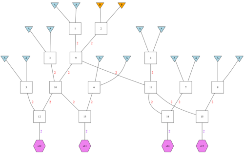

The purppose here is to compare Q values in BX1 and BX2 when we assume
no linkage, and when we don't.  We will simulate parametric values (from
segments) of Q under linkage.  When assuming no linkage, we will simulate the
values by sampling $\approx$50K gene copies.

To do this, we will be simulating from three different types of pedigrees.

This is left as a vignette as it might be instructive.


## Meet the pedigrees

Here, we will just make some pictures of our pedigrees.

### two_F1s

```{r, echo=FALSE, warning=FALSE, message=FALSE}
library(tidyverse)
library(gscramble)
library(parallel)
```

Get the pedigree:
```{r}
f <- system.file("extdata", "two_F1s.csv", package = "gscramble")
f1 <- read_csv(f)

gsp2dot(f1, file = "p.dot")
```

Then make the file
```{sh}
dot -Tpng p.dot > p.png;
convert p.png -resize 500x images/F1-500.png
```


## Four Backcross 1s

```{r, message=FALSE}
f <- system.file("extdata", "four_BX1s.csv", package = "gscramble")
bx1 <- read_csv(f)

gsp2dot(bx1, file = "p.dot")
```

Then make the file
```{sh}
dot -Tpng p.dot > p.png;
convert p.png -resize 500x images/four-BX1s-500.png
```




## Eight Backcross 2s

```{r, message=FALSE}
f <- system.file("extdata", "eight_BX2s.csv", package = "gscramble")
bx2 <- read_csv(f)

gsp2dot(bx2, file = "p.dot")
```

Then make the file
```{sh}
dot -Tpng p.dot > p.png;
convert p.png -resize 500x images/eight-BX2s-500.png
```




## Do the segregating

We will do F1 4 times and Bx1 2 times for each "round", and we can do, let's say,
1000 rounds in a sible simulation.  That will give us 8000 values to make a histogram with
for each of the relationships.  So 4000 F1s

We won't be sprinkling genes in at the end, so we just call pops A and B...
```{r}
tots <- 100
rp <- list(
  tibble(rep = rep(1:(4 * tots), each = 2),
              pop = rep(c("A", "B"), 4 * tots)) %>%
    mutate(group = pop),
  tibble(rep = rep(1:(2 * tots), each = 2),
              pop = rep(c("A", "B"), 2 * tots)) %>%
    mutate(group = pop),
  tibble(rep = rep(1:(1 * tots), each = 2),
              pop = rep(c("A", "B"), tots)) %>%
    mutate(group = pop)
)

request = tibble(
  gpp = list(f1, bx1, bx2),
  reppop = rp
)
```

The following takes a little while, so I will parallize it
```{r}
segs_list <- mclapply(1:10, function(i) {segregate(request, RecRates) %>%
  computeQs_from_segments()}, mc.cores = 8)

# when I ran that, a few of the cores through errors (rounding error issue, maybe?)
# So I will rerun the whole thing and then put them all together
segs_list2 <- mclapply(1:10, function(i) {segregate(request, RecRates) %>%
  computeQs_from_segments()}, mc.cores = 8)

# that had some errors too, but we won't worry about it.
# Just smoosh them together and go with it
names(segs_list) <- str_c("runs", sprintf("%02d", 1:10))
names(segs_list2) <- str_c("runs", sprintf("%02d", 21:30))
tib1 <- segs_list[-c(4,6)] %>% bind_rows()
tib2 <- segs_list2[-8] %>% bind_rows()

linked_Qs <- bind_rows(tib1, tib2) %>%
  filter(pop_origin == "A") %>% 
  mutate(hyb_cat = case_when(
    gpp == 1 ~ "F1",
    gpp == 2 ~ "Bx1",
    gpp == 3 ~ "Bx2",
    TRUE ~ "weird"
   ))

```

## Get the unlinked variety

In this case, we just simulate each locus independently.  So, let's make a function for that
```{r}
#' @param gp the three vector that gives expected fraction of different genotypes (2, 1 or 0
#' copies of the A allele.)
unlinked_sim <- function(n = 13600, L = 25165, gp ) {
  tibble(Q_un = colSums(rmultinom(n, L, gp) * c(2, 1, 0)) / (2 * L))
}
```

In this case
```{r}


unlinked_Qs <- list(
    F1_un = unlinked_sim(gp = c(0, 1, 0)),
     Bx1_un =  unlinked_sim(gp = c(0.5, 0.5, 0)),
     Bx2_un = unlinked_sim(gp = c(0.75, 0.25, 0))
     ) %>%
  bind_rows(.id = "hyb_cat")
```

## Now, do some plotting
Note, you can run the code from here if you have the rda file just like this:
```{r, eval=FALSE}
library(tidyverse)
load("../qstuff.rda")
```

```{r}
ggplot(linked_Qs, aes(x = admixture_fraction, fill = hyb_cat)) + 
  geom_histogram(binwidth = 0.01, position = "identity", colour = "black", alpha = 0.5) +
  theme_bw() +
  xlim(.2, 1) +
  scale_fill_manual(values = c(F1 = "red", Bx1 = "cyan", Bx2 = "blue"))
```

OK,  now, look at the unlinked ones:
```{r}
g <- ggplot(unlinked_Qs, aes(x = Q_un, fill = hyb_cat)) + 
  geom_histogram(binwidth = 0.01, position = "identity", colour = "black", alpha = 0.5) +
  theme_bw() +
  xlim(.4, 1) +
  scale_fill_manual(values = c(F1 = "red", Bx1 = "cyan", Bx2 = "blue", F1_un = "red", Bx1_un = "cyan", Bx2_un = "blue")) +
  xlab("Admixture Fraction") +
  ylab("Count (out of 13,600)") +
  guides(fill=guide_legend(title="Hybrid\nCategory"))

ggsave(g, filename = "qs_unlinked.pdf", width = 6, height = 2.5)
```

Now put them both in together:
```{r}
g2 <- ggplot() + 
  geom_histogram(data = unlinked_Qs,
                 mapping = aes(x = Q_un, fill = hyb_cat),
                 binwidth = 0.01, position = "identity", colour = "black", alpha = 0.5) +
  geom_histogram(data = linked_Qs,
                 mapping = aes(x = admixture_fraction, fill = hyb_cat),
                 binwidth = 0.01, position = "identity", colour = "black", alpha = 0.5) +
  theme_bw() +
  xlim(.4, 1) +
  scale_fill_manual(values = c(F1 = "red", Bx1 = "cyan", Bx2 = "blue", F1_un = NA, Bx1_un = NA, Bx2_un = NA),
                    breaks = c("F1", "Bx1", "Bx2")) +
  guides(fill=guide_legend(title="Hybrid\nCategory")) +
  xlab("Admixture Fraction") +
  ylab("Count (out of 13,600)")

ggsave(g2, filename = "qs_unlinked_and_linked.pdf", width = 6, height = 2.5)
```

